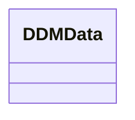

# Kafka

- **Diagram Type**: Logical
- **Package**: HomerSelect/BSL/Modules/CEL Account (CELA)/Interface Consumed/Kafka
- **Diagram ID**: 155970
- **Elements**: 1
- **Connectors**: 0

```mermaid
classDiagram
    class DDMData["DDMData"]
```
