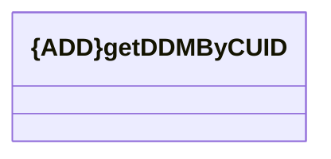

# getDDMByCUID

- **Diagram Type**: Logical
- **Package**: HomerSelect/BSL/Modules/CEL Account (CELA)/Interface Consumed/REST/BSL/v1/getDDMByCUID
- **Diagram ID**: 156342
- **Elements**: 1
- **Connectors**: 0

