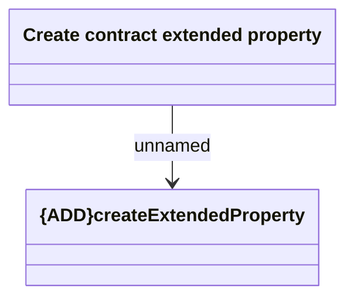

# createContractExtendedProperty

```mermaid
classDiagram
    class Create_contract_extended_property["Create contract extended property"]
    class ADD_createExtendedProperty["{ADD}createExtendedProperty"]
    Create_contract_extended_property --> ADD_createExtendedProperty : unnamed
```
