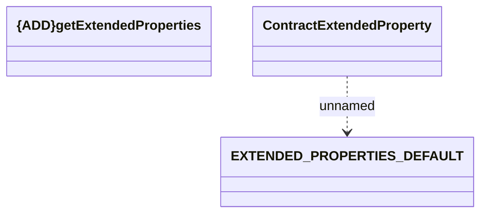

# getExtendedProperties

- **Diagram Type**: Logical
- **Package**: HomerSelect/BSL/Modules/CEL Account (CELA)/Interface Consumed/REST/COMA/v12/getExtendedProperties
- **Diagram ID**: 156349
- **Elements**: 3
- **Connectors**: 1

