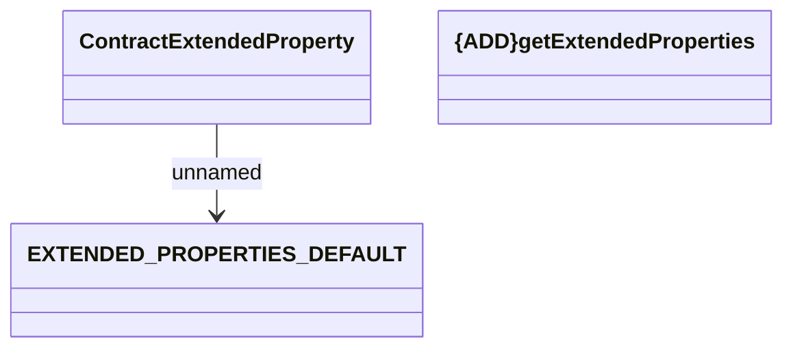

# getExtendedProperties

```mermaid
classDiagram
    class EXTENDED_PROPERTIES_DEFAULT["EXTENDED_PROPERTIES_DEFAULT"]
    class ContractExtendedProperty["ContractExtendedProperty"]
    class ADD_getExtendedProperties["{ADD}getExtendedProperties"]
    ContractExtendedProperty --> EXTENDED_PROPERTIES_DEFAULT : unnamed
```
