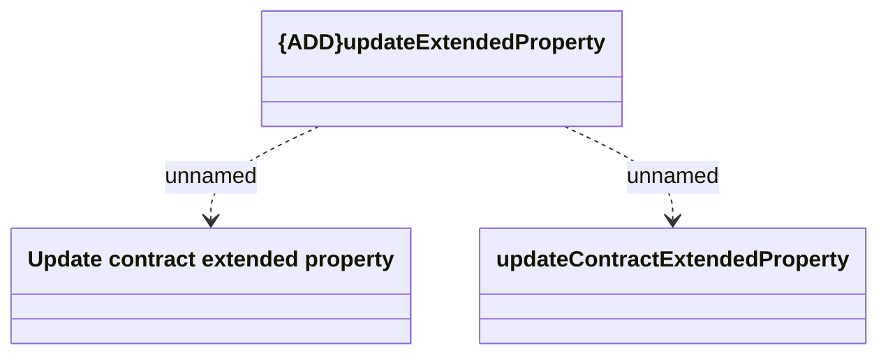

# updateContractExtendedProperty

- **Diagram Type**: Logical
- **Package**: HomerSelect/BSL/Modules/CEL Account (CELA)/Interface Consumed/REST/COMA/v12/updateContractExtendedProperty
- **Diagram ID**: 156350
- **Elements**: 3
- **Connectors**: 2

