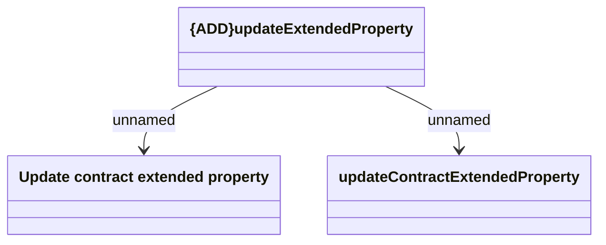

# updateContractExtendedProperty

```mermaid
classDiagram
    class updateContractExtendedProperty["updateContractExtendedProperty"]
    class Update_contract_extended_property["Update contract extended property"]
    class ADD_updateExtendedProperty["{ADD}updateExtendedProperty"]
    ADD_updateExtendedProperty --> Update_contract_extended_property : unnamed
    ADD_updateExtendedProperty --> updateContractExtendedProperty : unnamed
```
