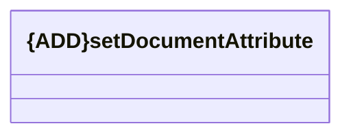

# setDocumentAttribute

- **Diagram Type**: Logical
- **Package**: HomerSelect/BSL/Modules/CEL Account (CELA)/Interface Consumed/REST/DMS/v2/setDocumentAttribute
- **Diagram ID**: 156353
- **Elements**: 1
- **Connectors**: 0

