# External Reference

- **Diagram Type**: Logical
- **Package**: HomerSelect/BSL/Modules/Client center (CLC)/Analytical Model/Client Detail/User Interface Model/Tab List of communication
- **Diagram ID**: 156160
- **Elements**: 11
- **Connectors**: 0

```mermaid
classDiagram
    class List_of_communication["List of communication"]
    class MOD_Show_Tab_List_of_communication["{MOD}Show Tab List of communication"]
    class Client_detail["Client detail"]
    class BSL["BSL"]
    class External_Reference["External Reference"]
    class External_Reference["External Reference"]
    class MOD_Loxon["{MOD}Loxon"]
    class External_Reference["External Reference"]
    class External_Reference["External Reference"]
    class MOD_Create_communication["{MOD}Create communication"]
    class MOD_List_of_communication["{MOD}List of communication"]
```

