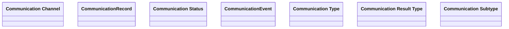

# Creating Communication

- **Diagram Type**: Logical
- **Package**: HomerSelect/BSL/Modules/Client center (CLC)/Analytical Model/Communication/Manage communication/Interface
- **Diagram ID**: 156279
- **Elements**: 7
- **Connectors**: 0

