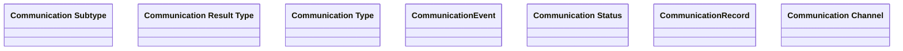

# Creating Communication

```mermaid
classDiagram
    class Communication_Subtype["Communication Subtype"]
    class Communication_Result_Type["Communication Result Type"]
    class Communication_Type["Communication Type"]
    class CommunicationEvent["CommunicationEvent"]
    class Communication_Status["Communication Status"]
    class CommunicationRecord["CommunicationRecord"]
    class Communication_Channel["Communication Channel"]
```
