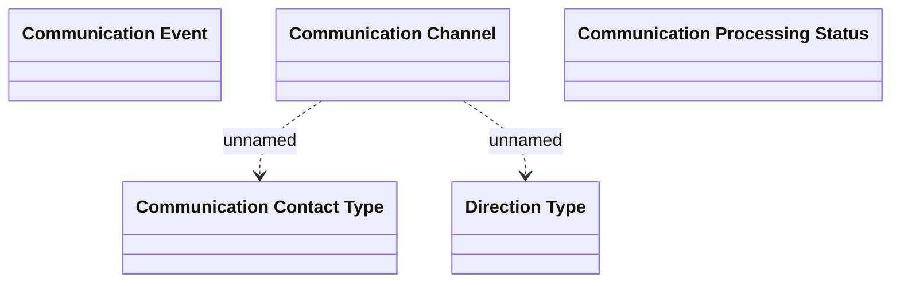

# Types

- **Diagram Type**: Logical
- **Package**: HomerSelect/BSL/Modules/Client center (CLC)/Analytical Model/Communication/Manage communication/Logical Data Model/Enums&Types
- **Diagram ID**: 156357
- **Elements**: 5
- **Connectors**: 2

