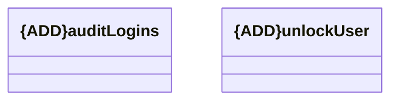

# auditLogins

- **Diagram Type**: Logical
- **Package**: HomerSelect/BSL/Modules/Client center (CLC)/Interface Consumed/REST/Audit service/v1.0/audit/logins
- **Diagram ID**: 156360
- **Elements**: 2
- **Connectors**: 0

