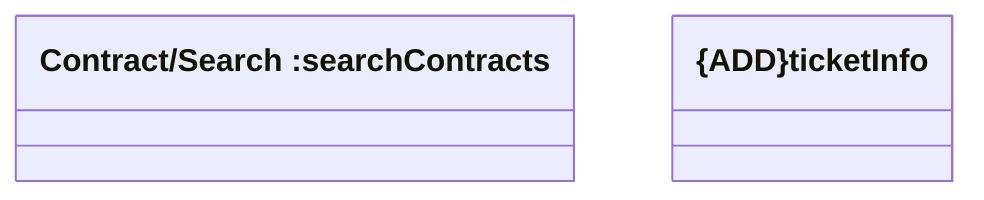

# Contract/Search

- **Diagram Type**: Logical
- **Package**: HomerSelect/BSL/Modules/Client center (CLC)/Interface Consumed/REST/COMA/v11.0/Contract/Search
- **Diagram ID**: 156162
- **Elements**: 2
- **Connectors**: 0

