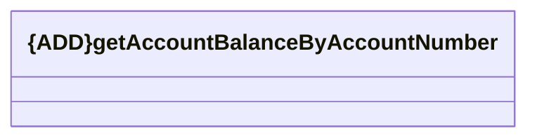

# getAccountByAccountNumber

- **Diagram Type**: Logical
- **Package**: HomerSelect/BSL/Modules/Client center (CLC)/Interface Consumed/REST/Cabus AM/v2.0/getAccountBalanceByAccountNumber
- **Diagram ID**: 156361
- **Elements**: 1
- **Connectors**: 0

