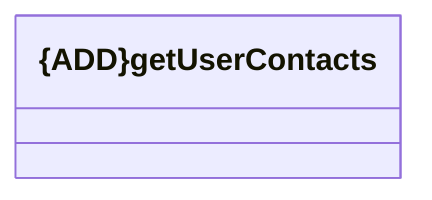

# getUserContacts

- **Diagram Type**: Logical
- **Package**: HomerSelect/BSL/Modules/Client center (CLC)/Interface Consumed/REST/Credential store/v1.0/getUserContacts
- **Diagram ID**: 156362
- **Elements**: 1
- **Connectors**: 0

