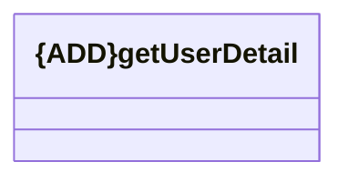

# getUserDetail

- **Diagram Type**: Logical
- **Package**: HomerSelect/BSL/Modules/Client center (CLC)/Interface Consumed/REST/Credential store/v1.0/getUserDetail
- **Diagram ID**: 156363
- **Elements**: 1
- **Connectors**: 0

