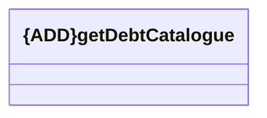

# getDebtCatalogue

- **Diagram Type**: Logical
- **Package**: HomerSelect/BSL/Modules/Client center (CLC)/Interface Consumed/REST/Debt catalogue/v1.0/debt-catalogue/getDebtCatalogue
- **Diagram ID**: 156169
- **Elements**: 1
- **Connectors**: 0

