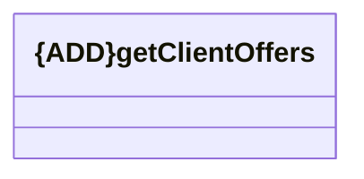

# getClientOffers

- **Diagram Type**: Logical
- **Package**: HomerSelect/BSL/Modules/Client center (CLC)/Interface Consumed/REST/Offer Store/getClientOffers
- **Diagram ID**: 156293
- **Elements**: 1
- **Connectors**: 0

