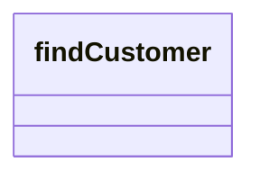

# findCustomer

- **Diagram Type**: Logical
- **Package**: HomerSelect/BSL/Modules/Client center (CLC)/Interface Consumed/REST/Party Identification Files/v1/findCustomer
- **Diagram ID**: 156050
- **Elements**: 1
- **Connectors**: 0

