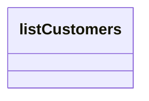

# listCustomers

- **Diagram Type**: Logical
- **Package**: HomerSelect/BSL/Modules/Client center (CLC)/Interface Consumed/REST/Party Identification Files/v1/listCustomers
- **Diagram ID**: 156367
- **Elements**: 1
- **Connectors**: 0

