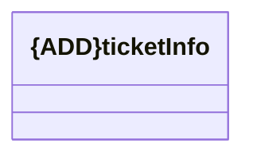

# ticketInfos

- **Diagram Type**: Logical
- **Package**: HomerSelect/BSL/Modules/Client center (CLC)/Interface Consumed/REST/Ticketing/v2.0/ticketInfos
- **Diagram ID**: 156370
- **Elements**: 1
- **Connectors**: 0

