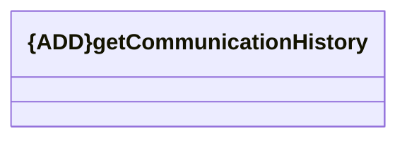

# getCommunicationHistory

- **Diagram Type**: Logical
- **Package**: HomerSelect/BSL/Modules/Client center (CLC)/Interface Consumed/REST/{DEL}OSB/v1.0/getCommunicationHistory
- **Diagram ID**: 157664
- **Elements**: 1
- **Connectors**: 0

