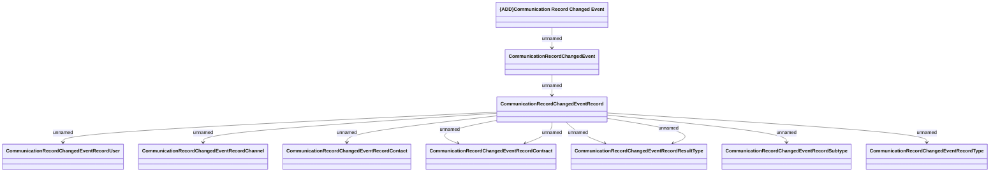

# CommunicationRecordChangedEvent

```mermaid
classDiagram
    class CommunicationRecordChangedEventRecordType["CommunicationRecordChangedEventRecordType"]
    class CommunicationRecordChangedEventRecordSubtype["CommunicationRecordChangedEventRecordSubtype"]
    class CommunicationRecordChangedEventRecordResultType["CommunicationRecordChangedEventRecordResultType"]
    class CommunicationRecordChangedEventRecordResultType["CommunicationRecordChangedEventRecordResultType"]
    class CommunicationRecordChangedEventRecordContract["CommunicationRecordChangedEventRecordContract"]
    class CommunicationRecordChangedEventRecordContract["CommunicationRecordChangedEventRecordContract"]
    class CommunicationRecordChangedEventRecordContact["CommunicationRecordChangedEventRecordContact"]
    class CommunicationRecordChangedEventRecordChannel["CommunicationRecordChangedEventRecordChannel"]
    class CommunicationRecordChangedEventRecordUser["CommunicationRecordChangedEventRecordUser"]
    class CommunicationRecordChangedEventRecord["CommunicationRecordChangedEventRecord"]
    class CommunicationRecordChangedEvent["CommunicationRecordChangedEvent"]
    class ADD_Communication_Record_Changed_Event["{ADD}Communication Record Changed Event"]
    ADD_Communication_Record_Changed_Event --> CommunicationRecordChangedEvent : unnamed
    CommunicationRecordChangedEvent --> CommunicationRecordChangedEventRecord : unnamed
    CommunicationRecordChangedEventRecord --> CommunicationRecordChangedEventRecordUser : unnamed
    CommunicationRecordChangedEventRecord --> CommunicationRecordChangedEventRecordChannel : unnamed
    CommunicationRecordChangedEventRecord --> CommunicationRecordChangedEventRecordContact : unnamed
    CommunicationRecordChangedEventRecord --> CommunicationRecordChangedEventRecordContract : unnamed
    CommunicationRecordChangedEventRecord --> CommunicationRecordChangedEventRecordContract : unnamed
    CommunicationRecordChangedEventRecord --> CommunicationRecordChangedEventRecordResultType : unnamed
    CommunicationRecordChangedEventRecord --> CommunicationRecordChangedEventRecordResultType : unnamed
    CommunicationRecordChangedEventRecord --> CommunicationRecordChangedEventRecordSubtype : unnamed
    CommunicationRecordChangedEventRecord --> CommunicationRecordChangedEventRecordType : unnamed
```
