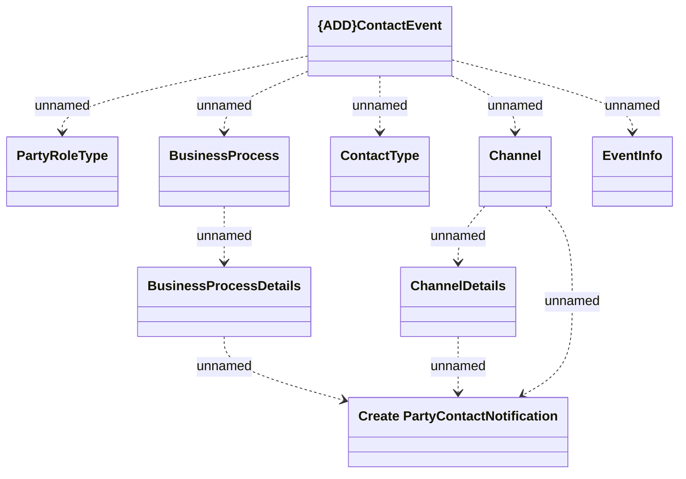

# ContactEvent

- **Diagram Type**: Logical
- **Package**: HomerSelect/BSL/Modules/Client center (CLC)/Interface Provided/Kafka/v1.0/ContactEvent
- **Diagram ID**: 156294
- **Elements**: 9
- **Connectors**: 10

