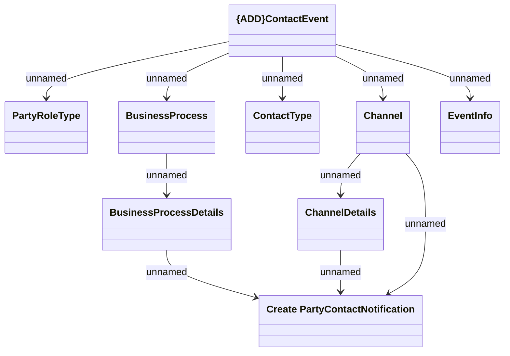

# ContactEvent

```mermaid
classDiagram
    class Create_PartyContactNotification["Create PartyContactNotification"]
    class PartyRoleType["PartyRoleType"]
    class BusinessProcessDetails["BusinessProcessDetails"]
    class ChannelDetails["ChannelDetails"]
    class BusinessProcess["BusinessProcess"]
    class ContactType["ContactType"]
    class Channel["Channel"]
    class ADD_ContactEvent["{ADD}ContactEvent"]
    class EventInfo["EventInfo"]
    ADD_ContactEvent --> EventInfo : unnamed
    ADD_ContactEvent --> Channel : unnamed
    ADD_ContactEvent --> ContactType : unnamed
    ADD_ContactEvent --> BusinessProcess : unnamed
    Channel --> ChannelDetails : unnamed
    BusinessProcess --> BusinessProcessDetails : unnamed
    ADD_ContactEvent --> PartyRoleType : unnamed
    BusinessProcessDetails --> Create_PartyContactNotification : unnamed
    ChannelDetails --> Create_PartyContactNotification : unnamed
    Channel --> Create_PartyContactNotification : unnamed
```
