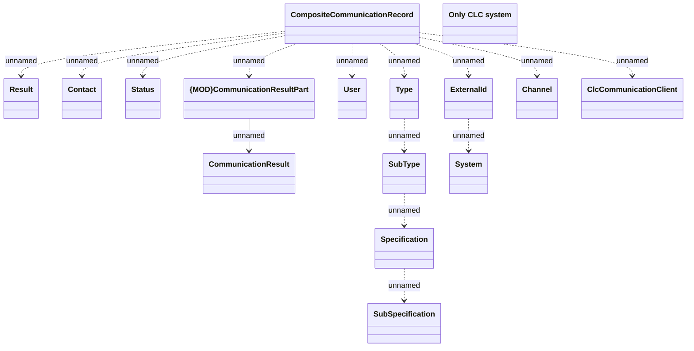

# Common

- **Diagram Type**: Logical
- **Package**: HomerSelect/BSL/Modules/Client center (CLC)/Interface Provided/REST API/v1/Common 
- **Diagram ID**: 157662
- **Elements**: 16
- **Connectors**: 14

