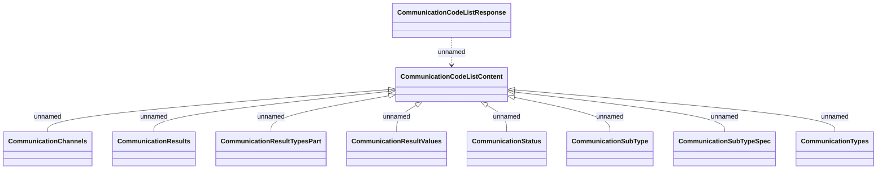

# CommunicationCodeListResponse

- **Diagram Type**: Logical
- **Package**: HomerSelect/BSL/Modules/Client center (CLC)/Interface Provided/REST API/v1/codeList
- **Diagram ID**: 163398
- **Elements**: 10
- **Connectors**: 9

