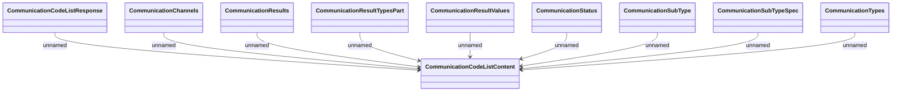

# CommunicationCodeListResponse

```mermaid
classDiagram
    class CommunicationResultValues["CommunicationResultValues"]
    class CommunicationResultTypesPart["CommunicationResultTypesPart"]
    class CommunicationStatus["CommunicationStatus"]
    class CommunicationTypes["CommunicationTypes"]
    class CommunicationCodeListContent["CommunicationCodeListContent"]
    class CommunicationCodeListResponse["CommunicationCodeListResponse"]
    class CommunicationChannels["CommunicationChannels"]
    class CommunicationSubType["CommunicationSubType"]
    class CommunicationSubTypeSpec["CommunicationSubTypeSpec"]
    class CommunicationResults["CommunicationResults"]
    CommunicationCodeListResponse --> CommunicationCodeListContent : unnamed
    CommunicationChannels --> CommunicationCodeListContent : unnamed
    CommunicationResults --> CommunicationCodeListContent : unnamed
    CommunicationResultTypesPart --> CommunicationCodeListContent : unnamed
    CommunicationResultValues --> CommunicationCodeListContent : unnamed
    CommunicationStatus --> CommunicationCodeListContent : unnamed
    CommunicationSubType --> CommunicationCodeListContent : unnamed
    CommunicationSubTypeSpec --> CommunicationCodeListContent : unnamed
    CommunicationTypes --> CommunicationCodeListContent : unnamed
```
