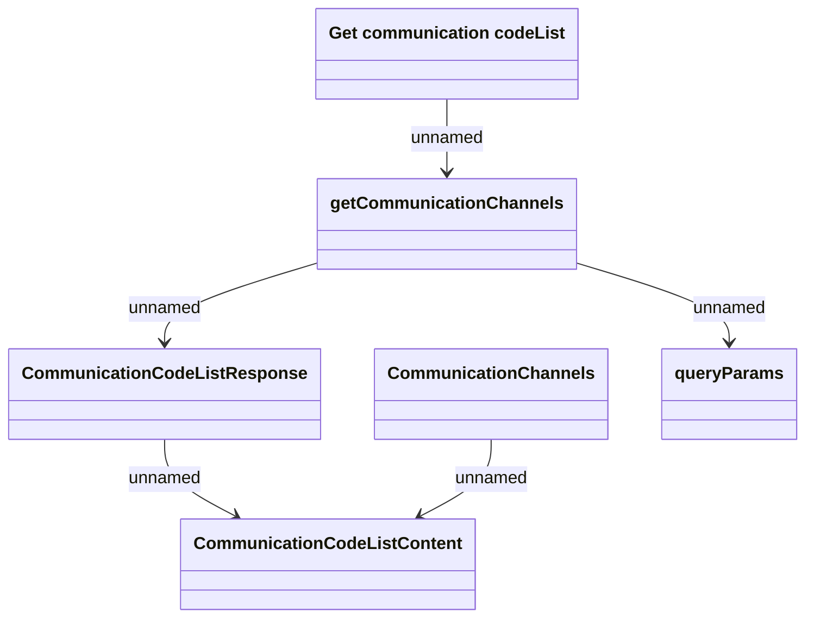

# getCommunicationChannels

```mermaid
classDiagram
    class Get_communication_codeList["Get communication codeList"]
    class CommunicationCodeListContent["CommunicationCodeListContent"]
    class CommunicationChannels["CommunicationChannels"]
    class CommunicationCodeListResponse["CommunicationCodeListResponse"]
    class getCommunicationChannels["getCommunicationChannels"]
    class queryParams["queryParams"]
    CommunicationCodeListResponse --> CommunicationCodeListContent : unnamed
    CommunicationChannels --> CommunicationCodeListContent : unnamed
    getCommunicationChannels --> CommunicationCodeListResponse : unnamed
    getCommunicationChannels --> queryParams : unnamed
    Get_communication_codeList --> getCommunicationChannels : unnamed
```
