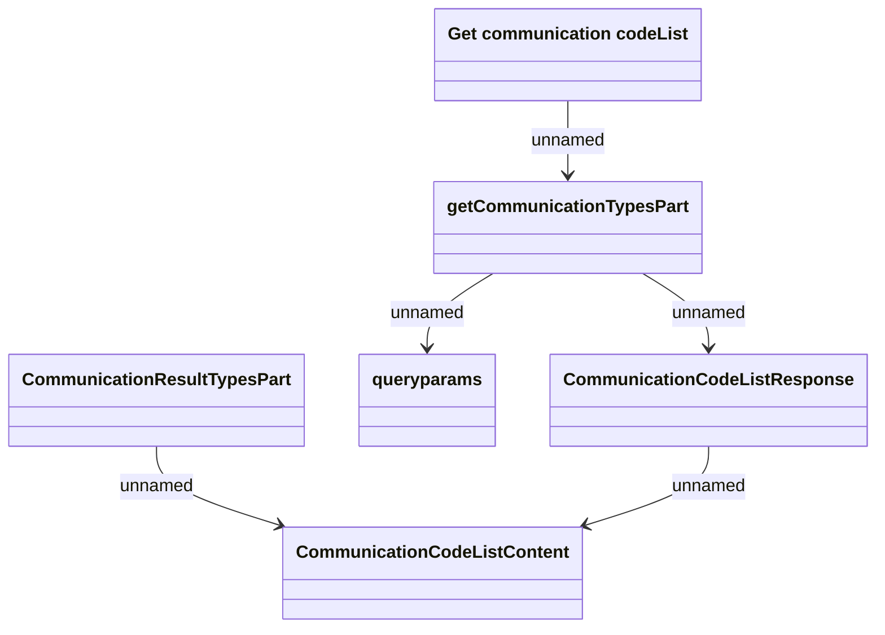

# getCommunicationResultTypesPart

```mermaid
classDiagram
    class Get_communication_codeList["Get communication codeList"]
    class CommunicationResultTypesPart["CommunicationResultTypesPart"]
    class queryparams["queryparams"]
    class getCommunicationTypesPart["getCommunicationTypesPart"]
    class CommunicationCodeListResponse["CommunicationCodeListResponse"]
    class CommunicationCodeListContent["CommunicationCodeListContent"]
    CommunicationResultTypesPart --> CommunicationCodeListContent : unnamed
    CommunicationCodeListResponse --> CommunicationCodeListContent : unnamed
    getCommunicationTypesPart --> CommunicationCodeListResponse : unnamed
    getCommunicationTypesPart --> queryparams : unnamed
    Get_communication_codeList --> getCommunicationTypesPart : unnamed
```
