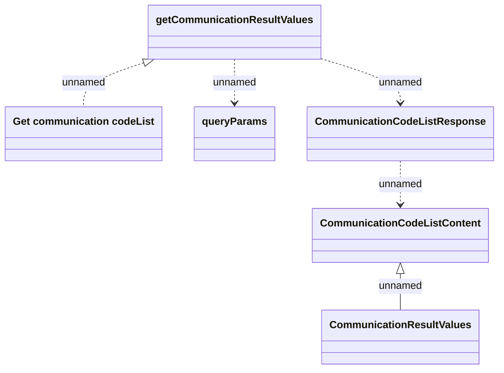

# getCommunicationResultValues

- **Diagram Type**: Logical
- **Package**: HomerSelect/BSL/Modules/Client center (CLC)/Interface Provided/REST API/v1/codeList/getCommunicationResultValues
- **Diagram ID**: 163403
- **Elements**: 6
- **Connectors**: 5

