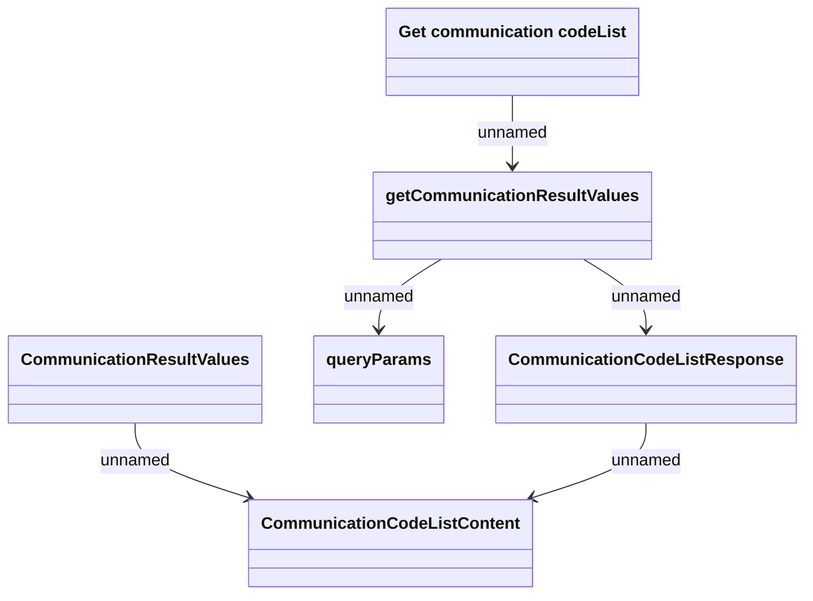

# getCommunicationResultValues

```mermaid
classDiagram
    class Get_communication_codeList["Get communication codeList"]
    class CommunicationResultValues["CommunicationResultValues"]
    class queryParams["queryParams"]
    class getCommunicationResultValues["getCommunicationResultValues"]
    class CommunicationCodeListResponse["CommunicationCodeListResponse"]
    class CommunicationCodeListContent["CommunicationCodeListContent"]
    CommunicationResultValues --> CommunicationCodeListContent : unnamed
    CommunicationCodeListResponse --> CommunicationCodeListContent : unnamed
    getCommunicationResultValues --> CommunicationCodeListResponse : unnamed
    getCommunicationResultValues --> queryParams : unnamed
    Get_communication_codeList --> getCommunicationResultValues : unnamed
```
