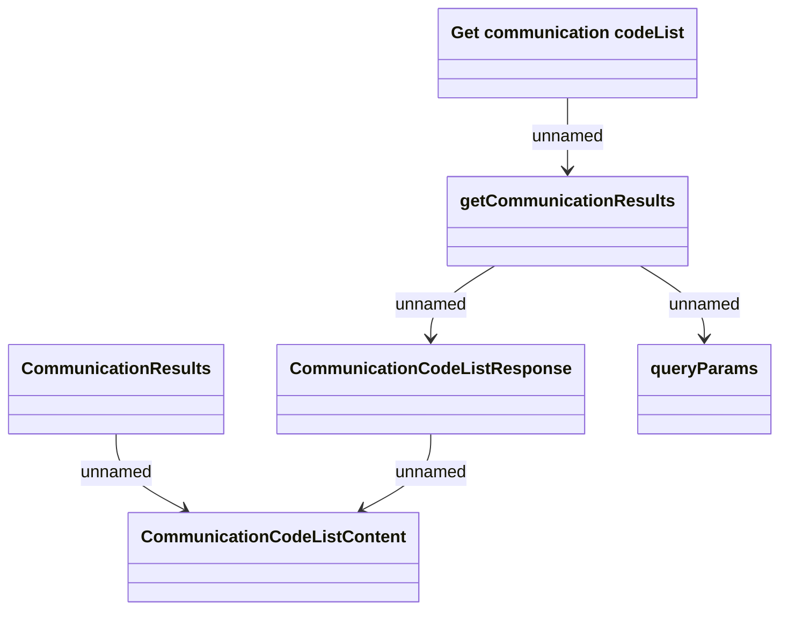

# getCommunicationResults

```mermaid
classDiagram
    class Get_communication_codeList["Get communication codeList"]
    class CommunicationCodeListContent["CommunicationCodeListContent"]
    class CommunicationCodeListResponse["CommunicationCodeListResponse"]
    class CommunicationResults["CommunicationResults"]
    class queryParams["queryParams"]
    class getCommunicationResults["getCommunicationResults"]
    getCommunicationResults --> queryParams : unnamed
    getCommunicationResults --> CommunicationCodeListResponse : unnamed
    CommunicationResults --> CommunicationCodeListContent : unnamed
    CommunicationCodeListResponse --> CommunicationCodeListContent : unnamed
    Get_communication_codeList --> getCommunicationResults : unnamed
```
