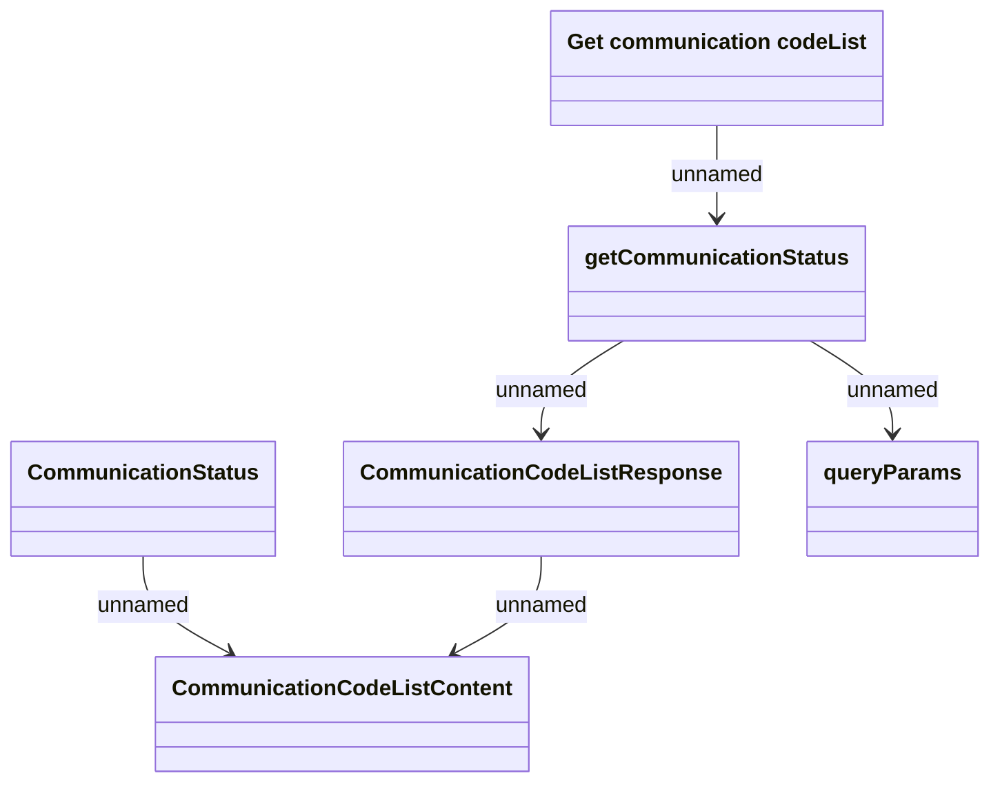

# getCommunicationStatus

```mermaid
classDiagram
    class Get_communication_codeList["Get communication codeList"]
    class CommunicationCodeListContent["CommunicationCodeListContent"]
    class CommunicationCodeListResponse["CommunicationCodeListResponse"]
    class CommunicationStatus["CommunicationStatus"]
    class getCommunicationStatus["getCommunicationStatus"]
    class queryParams["queryParams"]
    CommunicationStatus --> CommunicationCodeListContent : unnamed
    CommunicationCodeListResponse --> CommunicationCodeListContent : unnamed
    getCommunicationStatus --> CommunicationCodeListResponse : unnamed
    getCommunicationStatus --> queryParams : unnamed
    Get_communication_codeList --> getCommunicationStatus : unnamed
```
