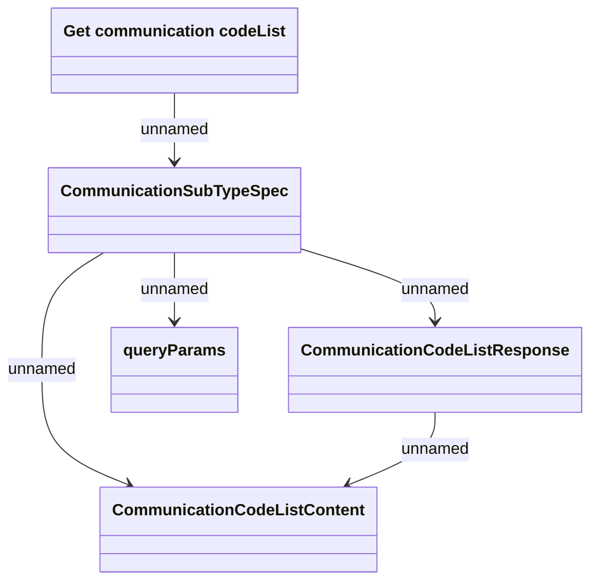

# getCommunicationSubTypeSpec

```mermaid
classDiagram
    class Get_communication_codeList["Get communication codeList"]
    class CommunicationCodeListContent["CommunicationCodeListContent"]
    class CommunicationCodeListResponse["CommunicationCodeListResponse"]
    class CommunicationSubTypeSpec["CommunicationSubTypeSpec"]
    class queryParams["queryParams"]
    class CommunicationSubTypeSpec["CommunicationSubTypeSpec"]
    CommunicationSubTypeSpec --> CommunicationCodeListContent : unnamed
    CommunicationCodeListResponse --> CommunicationCodeListContent : unnamed
    CommunicationSubTypeSpec --> CommunicationCodeListResponse : unnamed
    CommunicationSubTypeSpec --> queryParams : unnamed
    Get_communication_codeList --> CommunicationSubTypeSpec : unnamed
```
