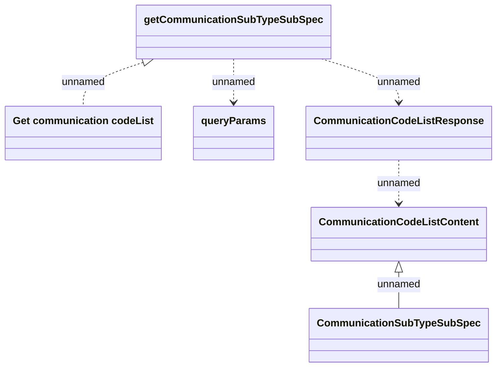

# getCommunicationSubTypeSubSpec

- **Diagram Type**: Logical
- **Package**: HomerSelect/BSL/Modules/Client center (CLC)/Interface Provided/REST API/v1/codeList/getCommunicationSubTypeSubSpec
- **Diagram ID**: 163407
- **Elements**: 6
- **Connectors**: 5

