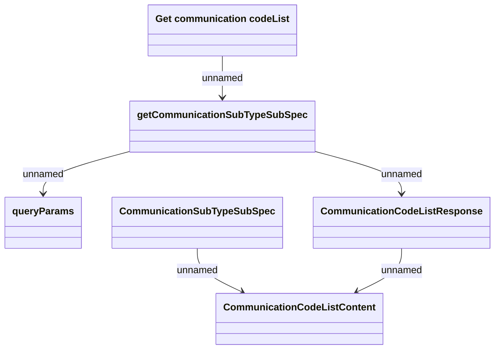

# getCommunicationSubTypeSubSpec

```mermaid
classDiagram
    class Get_communication_codeList["Get communication codeList"]
    class getCommunicationSubTypeSubSpec["getCommunicationSubTypeSubSpec"]
    class queryParams["queryParams"]
    class CommunicationSubTypeSubSpec["CommunicationSubTypeSubSpec"]
    class CommunicationCodeListResponse["CommunicationCodeListResponse"]
    class CommunicationCodeListContent["CommunicationCodeListContent"]
    CommunicationSubTypeSubSpec --> CommunicationCodeListContent : unnamed
    CommunicationCodeListResponse --> CommunicationCodeListContent : unnamed
    getCommunicationSubTypeSubSpec --> CommunicationCodeListResponse : unnamed
    getCommunicationSubTypeSubSpec --> queryParams : unnamed
    Get_communication_codeList --> getCommunicationSubTypeSubSpec : unnamed
```
