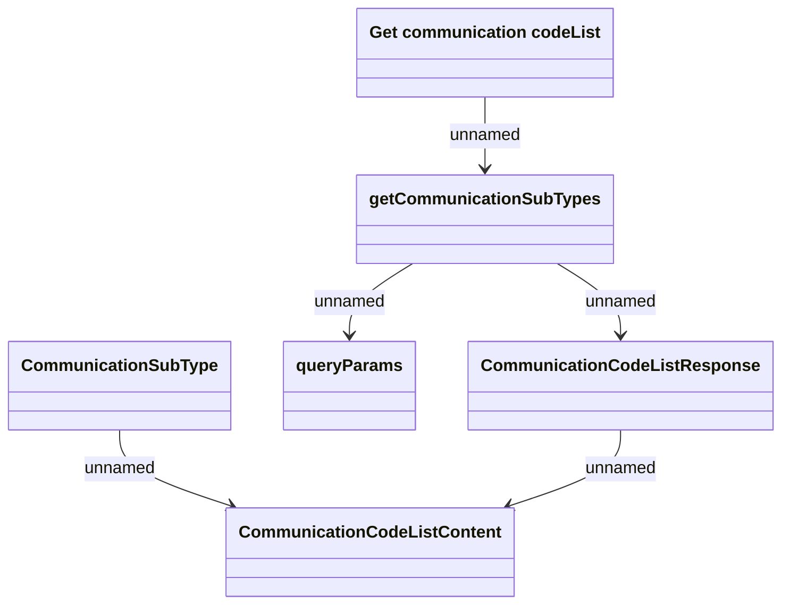

# getCommunicationSubTypes

```mermaid
classDiagram
    class Get_communication_codeList["Get communication codeList"]
    class CommunicationSubType["CommunicationSubType"]
    class queryParams["queryParams"]
    class getCommunicationSubTypes["getCommunicationSubTypes"]
    class CommunicationCodeListContent["CommunicationCodeListContent"]
    class CommunicationCodeListResponse["CommunicationCodeListResponse"]
    getCommunicationSubTypes --> CommunicationCodeListResponse : unnamed
    CommunicationSubType --> CommunicationCodeListContent : unnamed
    CommunicationCodeListResponse --> CommunicationCodeListContent : unnamed
    getCommunicationSubTypes --> queryParams : unnamed
    Get_communication_codeList --> getCommunicationSubTypes : unnamed
```
