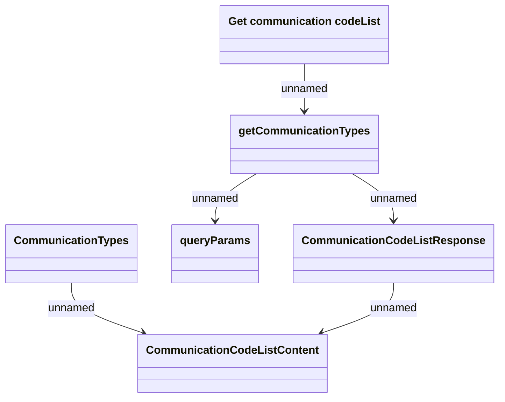

# getCommunicationTypes

```mermaid
classDiagram
    class Get_communication_codeList["Get communication codeList"]
    class CommunicationCodeListContent["CommunicationCodeListContent"]
    class CommunicationCodeListResponse["CommunicationCodeListResponse"]
    class queryParams["queryParams"]
    class CommunicationTypes["CommunicationTypes"]
    class getCommunicationTypes["getCommunicationTypes"]
    CommunicationTypes --> CommunicationCodeListContent : unnamed
    CommunicationCodeListResponse --> CommunicationCodeListContent : unnamed
    getCommunicationTypes --> CommunicationCodeListResponse : unnamed
    getCommunicationTypes --> queryParams : unnamed
    Get_communication_codeList --> getCommunicationTypes : unnamed
```
