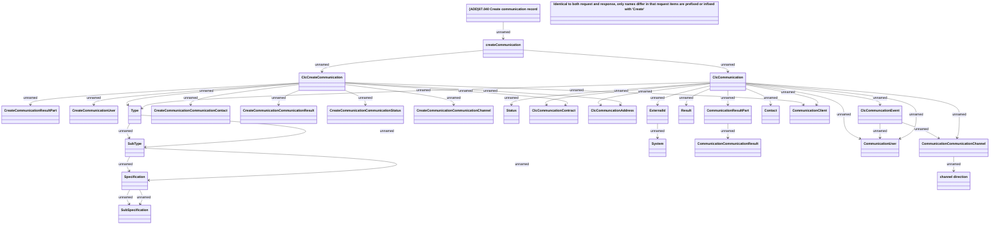

# createCommunication

```mermaid
classDiagram
    class ADD_07_040_Create_communication_record["{ADD}07.040 Create communication record"]
    class CreateCommunicationResultPart["CreateCommunicationResultPart"]
    class CreateCommunicationUser["CreateCommunicationUser"]
    class Specification["Specification"]
    class SubType["SubType"]
    class Type["Type"]
    class CreateCommunicationCommunicationContact["CreateCommunicationCommunicationContact"]
    class CreateCommunicationCommunicationResult["CreateCommunicationCommunicationResult"]
    class CreateCommunicationCommunicationStatus["CreateCommunicationCommunicationStatus"]
    class CreateCommunicationCommunicationChannel["CreateCommunicationCommunicationChannel"]
    class ClcCreateCommunication["ClcCreateCommunication"]
    class Status["Status"]
    class System["System"]
    class channel_direction["channel direction "]
    class ClcCommuncationContract["ClcCommuncationContract"]
    class ClcCommuncationAddress["ClcCommuncationAddress"]
    class CommunicationCommunicationResult["CommunicationCommunicationResult"]
    class ClcCommuncationEvent["ClcCommuncationEvent"]
    class createCommunication["createCommunication"]
    class CommunicationUser["CommunicationUser"]
    class Type["Type"]
    class SubType["SubType"]
    class SubSpecification["SubSpecification"]
    class Specification["Specification"]
    class Result["Result"]
    class CommunicationCommunicationChannel["CommunicationCommunicationChannel"]
    class ExternalId["ExternalId"]
    class Contact["Contact"]
    class ClcCommunication["ClcCommunication"]
    class CommunicationClient["CommunicationClient"]
    class CommunicationResultPart["CommunicationResultPart"]
    class Identical_to_both_request_and_response_only_names_differ_in_["Identical to both request and response, only names differ in that request items are prefixed or infixed with 'Create'"]
    ClcCreateCommunication --> CreateCommunicationCommunicationChannel : unnamed
    ClcCommunication --> ClcCommuncationAddress : unnamed
    ClcCreateCommunication --> ClcCommuncationAddress : unnamed
    ClcCommunication --> ClcCommuncationContract : unnamed
    ClcCreateCommunication --> ClcCommuncationContract : unnamed
    CommunicationCommunicationChannel --> channel_direction : unnamed
    ClcCreateCommunication --> CreateCommunicationResultPart : unnamed
    createCommunication --> ClcCreateCommunication : unnamed
    ClcCreateCommunication --> CreateCommunicationCommunicationStatus : unnamed
    ClcCreateCommunication --> CreateCommunicationCommunicationResult : unnamed
    ClcCreateCommunication --> CreateCommunicationCommunicationContact : unnamed
    ClcCreateCommunication --> Type : unnamed
    Type --> SubType : unnamed
    SubType --> Specification : unnamed
    ClcCreateCommunication --> CreateCommunicationUser : unnamed
    ClcCommunication --> Status : unnamed
    Specification --> SubSpecification : unnamed
    ClcCreateCommunication --> CommunicationClient : unnamed
    ClcCommunication --> CommunicationClient : unnamed
    createCommunication --> ClcCommunication : unnamed
    ClcCommunication --> Contact : unnamed
    ClcCommunication --> ExternalId : unnamed
    ClcCommuncationEvent --> CommunicationCommunicationChannel : unnamed
    ClcCommunication --> CommunicationCommunicationChannel : unnamed
    CommunicationResultPart --> CommunicationCommunicationResult : unnamed
    SubType --> Specification : unnamed
    ClcCommunication --> ClcCommuncationEvent : unnamed
    Specification --> SubSpecification : unnamed
    Type --> SubType : unnamed
    ClcCommunication --> Type : unnamed
    ClcCommunication --> CommunicationUser : unnamed
    ClcCommuncationEvent --> CommunicationUser : unnamed
    ClcCommunication --> CommunicationUser : unnamed
    ClcCommunication --> CommunicationResultPart : unnamed
    ClcCommunication --> Result : unnamed
    ExternalId --> System : unnamed
    ADD_07_040_Create_communication_record --> createCommunication : unnamed
```
