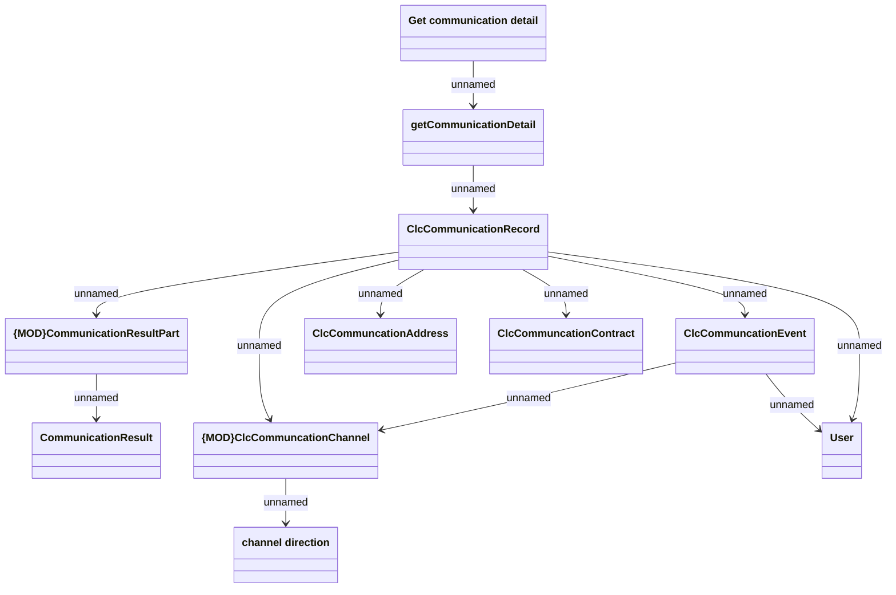

# getCommunicationDetail

```mermaid
classDiagram
    class User["User"]
    class Get_communication_detail["Get communication detail"]
    class getCommunicationDetail["getCommunicationDetail"]
    class ClcCommuncationEvent["ClcCommuncationEvent"]
    class ClcCommuncationContract["ClcCommuncationContract"]
    class ClcCommuncationAddress["ClcCommuncationAddress"]
    class MOD_ClcCommuncationChannel["{MOD}ClcCommuncationChannel"]
    class channel_direction["channel direction "]
    class ClcCommunicationRecord["ClcCommunicationRecord"]
    class CommunicationResult["CommunicationResult"]
    class MOD_CommunicationResultPart["{MOD}CommunicationResultPart"]
    ClcCommunicationRecord --> MOD_CommunicationResultPart : unnamed
    getCommunicationDetail --> ClcCommunicationRecord : unnamed
    MOD_ClcCommuncationChannel --> channel_direction : unnamed
    ClcCommuncationEvent --> MOD_ClcCommuncationChannel : unnamed
    ClcCommunicationRecord --> MOD_ClcCommuncationChannel : unnamed
    ClcCommunicationRecord --> ClcCommuncationAddress : unnamed
    ClcCommunicationRecord --> ClcCommuncationContract : unnamed
    ClcCommunicationRecord --> ClcCommuncationEvent : unnamed
    ClcCommuncationEvent --> User : unnamed
    ClcCommunicationRecord --> User : unnamed
    MOD_CommunicationResultPart --> CommunicationResult : unnamed
    Get_communication_detail --> getCommunicationDetail : unnamed
```
