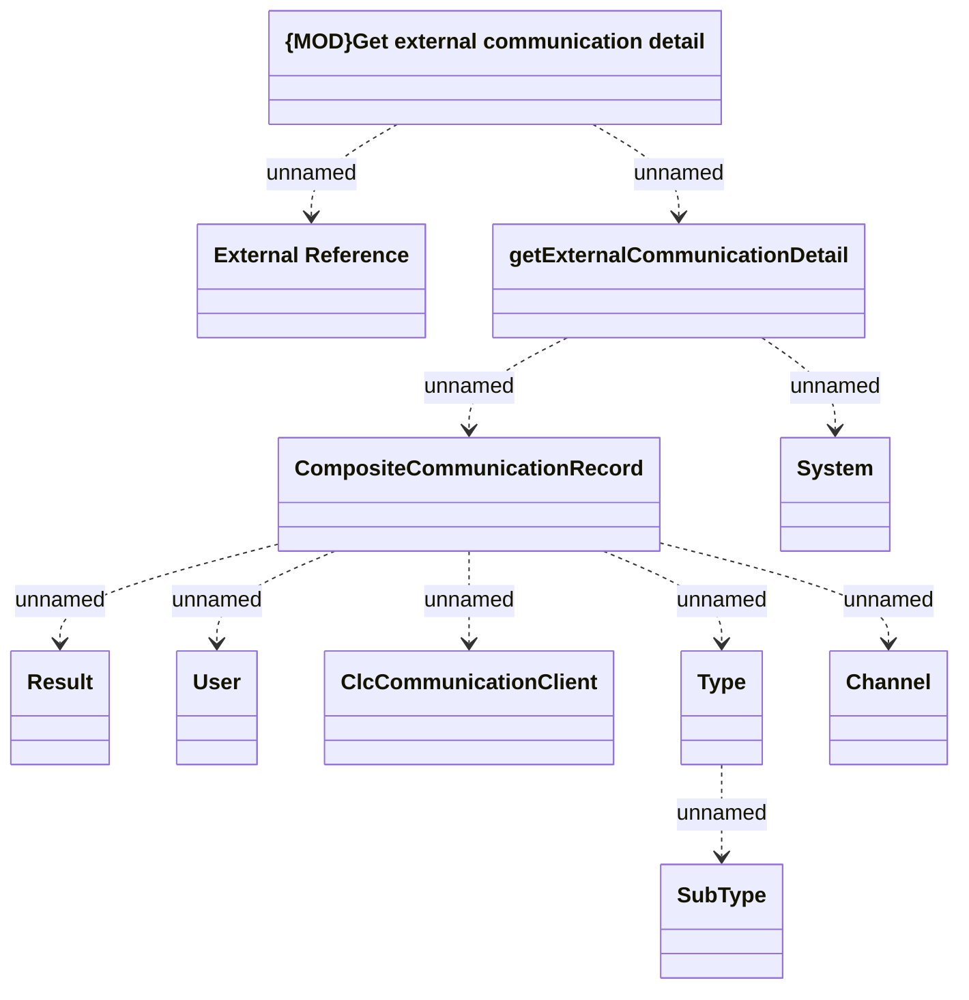

# getExternalCommunicationDetail

- **Diagram Type**: Logical
- **Package**: HomerSelect/BSL/Modules/Client center (CLC)/Interface Provided/REST API/v1/getExternalCommunicationDetail
- **Diagram ID**: 157663
- **Elements**: 11
- **Connectors**: 10

