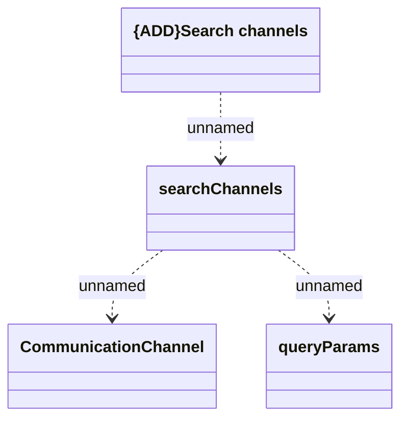

# searchChannels

- **Diagram Type**: Logical
- **Package**: HomerSelect/BSL/Modules/Client center (CLC)/Interface Provided/REST API/v1/searchChannels
- **Diagram ID**: 156175
- **Elements**: 4
- **Connectors**: 3

