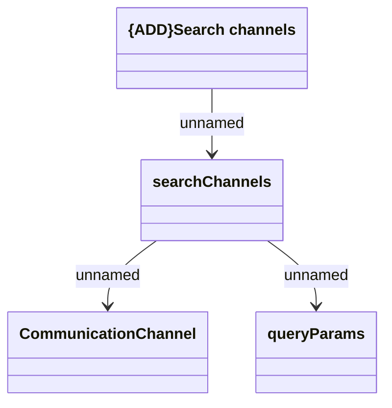

# searchChannels

```mermaid
classDiagram
    class ADD_Search_channels["{ADD}Search channels"]
    class queryParams["queryParams"]
    class CommunicationChannel["CommunicationChannel"]
    class searchChannels["searchChannels"]
    searchChannels --> CommunicationChannel : unnamed
    searchChannels --> queryParams : unnamed
    ADD_Search_channels --> searchChannels : unnamed
```
