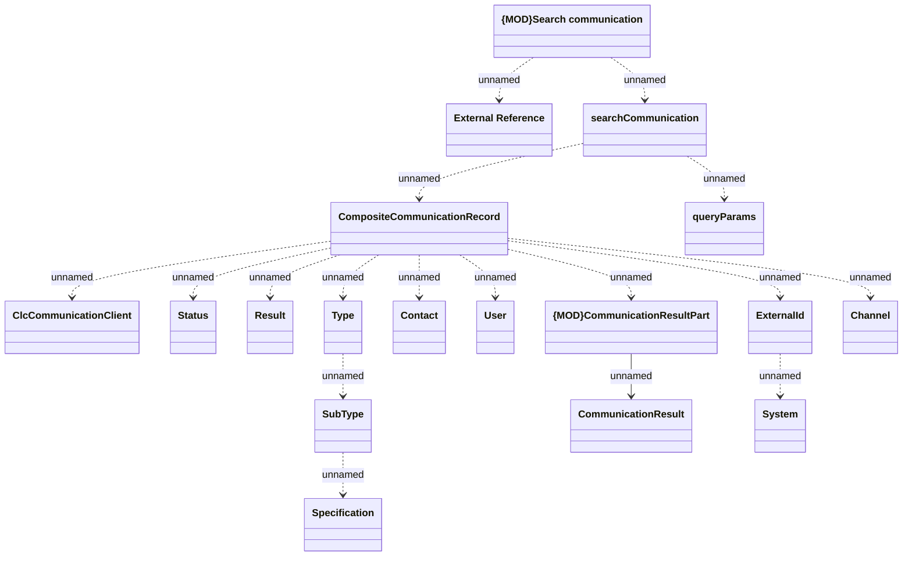

# searchCommunication

- **Diagram Type**: Logical
- **Package**: HomerSelect/BSL/Modules/Client center (CLC)/Interface Provided/REST API/v1/searchCommunication
- **Diagram ID**: 156183
- **Elements**: 18
- **Connectors**: 17

