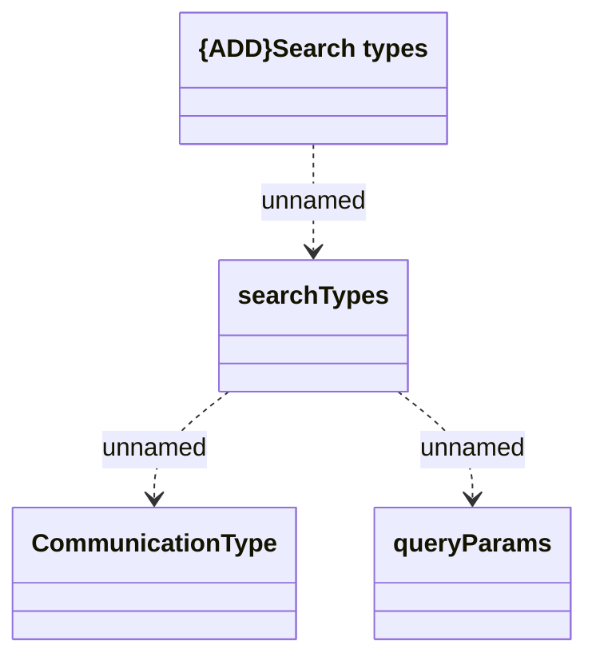

# searchTypes

- **Diagram Type**: Logical
- **Package**: HomerSelect/BSL/Modules/Client center (CLC)/Interface Provided/REST API/v1/searchTypes
- **Diagram ID**: 156176
- **Elements**: 4
- **Connectors**: 3

