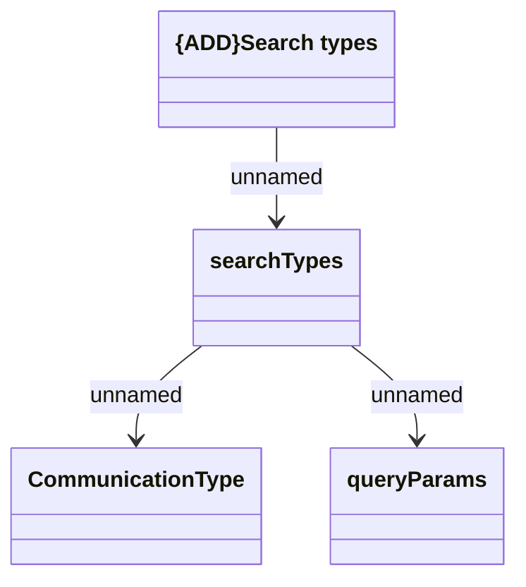

# searchTypes

```mermaid
classDiagram
    class ADD_Search_types["{ADD}Search types"]
    class queryParams["queryParams"]
    class CommunicationType["CommunicationType"]
    class searchTypes["searchTypes"]
    searchTypes --> CommunicationType : unnamed
    searchTypes --> queryParams : unnamed
    ADD_Search_types --> searchTypes : unnamed
```
