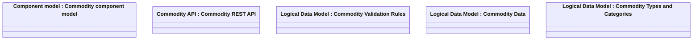

# Commodity - overview

- **Diagram Type**: Logical
- **Package**: HomerSelect/BSL/Modules/Commodity
- **Diagram ID**: 160940
- **Elements**: 5
- **Connectors**: 0

```mermaid
classDiagram
    class Component_model_Commodity_component_model["Component model : Commodity component model"]
    class Commodity_API_Commodity_REST_API["Commodity API : Commodity REST API"]
    class Logical_Data_Model_Commodity_Validation_Rules["Logical Data Model : Commodity Validation Rules"]
    class Logical_Data_Model_Commodity_Data["Logical Data Model : Commodity Data"]
    class Logical_Data_Model_Commodity_Types_and_Categories["Logical Data Model : Commodity Types and Categories"]
```
