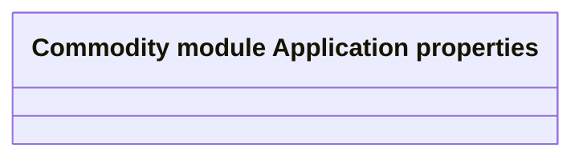

# Application Properties

- **Diagram Type**: Logical
- **Package**: HomerSelect/BSL/Modules/Commodity/Analytical Model/COMMON for Commodity/Application Properties
- **Diagram ID**: 160946
- **Elements**: 1
- **Connectors**: 0

